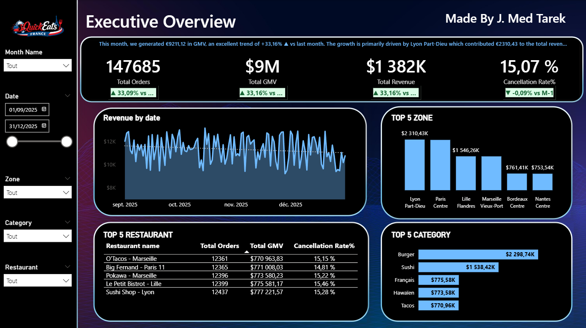
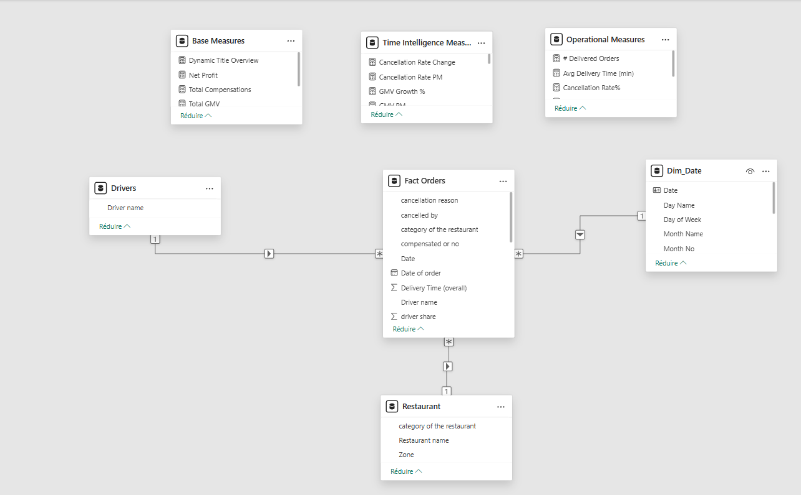
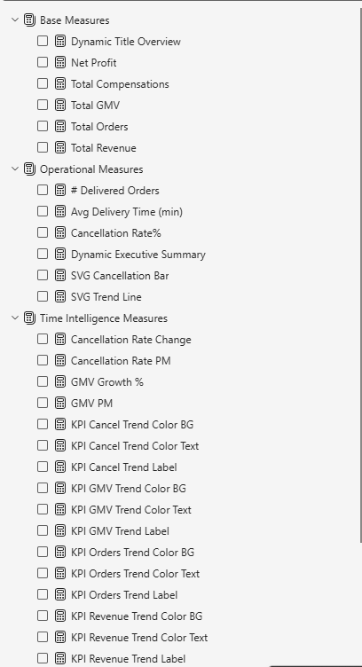

# Executive Food Delivery Dashboard

## Dashboard Preview

---

## Project Overview

This project is an executive-level Power BI dashboard designed to monitor and analyze food delivery operations performance.

The dashboard focuses on:

- Revenue Monitoring
- GMV Tracking
- Cancellation Analysis
- Zone Performance
- Restaurant KPIs
- Operational Monitoring
- Time Intelligence Analysis

---

# Business Objective

The goal of this dashboard is to provide management teams with a clear operational overview to support data-driven decision-making.

---

# Tools & Technologies

- Power BI
- DAX
- Python
- Data Modeling
- Power Query

---

# Key Features

## KPI Monitoring
- Total Orders
- Total GMV
- Revenue Tracking
- Cancellation Rate

## Operational Analysis
- Top Performing Zones
- Top Restaurants
- Category Analysis

## Time Intelligence
- Month-over-Month Growth
- Revenue Trends
- Performance Tracking

---

# Data Model

The project uses a Star Schema data model including:

- Fact Orders
- Date Dimension
- Restaurant Dimension
- Driver Dimension

Measures are organized into:
- Base Measures
- Operational Measures
- Time Intelligence Measures

---

## Data Model

## DAX Measures

---

## Note

The original dataset is not publicly shared.
A simulated/demo dataset was used for portfolio demonstration purposes.

---

# Insights Generated

- Identified top-performing delivery zones
- Monitored cancellation trends
- Analyzed category revenue distribution
- Tracked operational performance KPIs

---

# Dataset Information

The dataset used in this project was generated using Python for realistic business simulation purposes.

---

# Author

Mohamed Tarek Jebali

CX Analyst | BI Analyst | Zendesk Admin | Operations Specialist
